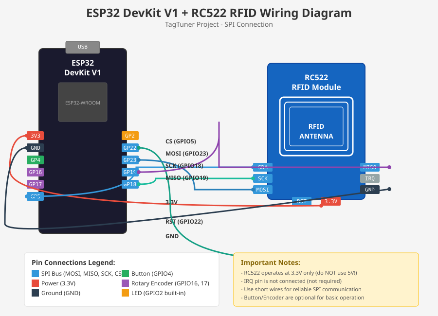

## Build your own TagTuner with ESP32 DevKit and RC522 RFID

This guide covers building a TagTuner using an ESP32 DevKit V1 (or compatible ESP32-WROOM-32 board) with an RC522 RFID reader module.

### Key Differences from PN532 Version

The RC522 module uses SPI interface instead of I2C, making it a cost-effective alternative to the PN532:

| Feature | PN532 | RC522 |
|---------|-------|-------|
| Interface | I2C | SPI |
| Tag Types | Mifare Classic, Ultralight, NFC Forum | Mifare Classic 1K/4K |
| Operating Voltage | 3.3V-5V | 3.3V only |
| Cost | Higher | Lower |
| Read Range | ~5cm | ~3cm |

### Parts for ESP32 DevKit + RC522 Version

- ESP32 DevKit V1 (or compatible ESP32-WROOM-32 board)
- RC522 RFID Reader Module (MFRC522)
- Rotary encoder (HW-040) with button (optional)
- Jumper wires
- Breadboard (for prototyping)

### Wiring Diagram



#### RC522 RFID Module (SPI Connection)

| RC522 Pin | ESP32 Pin | Description |
|-----------|-----------|-------------|
| SDA (SS)  | GPIO 5    | SPI Chip Select |
| SCK       | GPIO 18   | SPI Clock |
| MOSI      | GPIO 23   | SPI Master Out Slave In |
| MISO      | GPIO 19   | SPI Master In Slave Out |
| IRQ       | N/C       | Not connected (not used) |
| GND       | GND       | Ground |
| RST       | GPIO 21   | Reset (LOW=power-down, HIGH=reset) |
| 3.3V      | 3.3V      | Power (3.3V only!) |

**IMPORTANT:** The RC522 module operates at 3.3V only. Do NOT connect it to 5V as this will damage the module!

#### Optional: Button and Rotary Encoder

| Component | ESP32 Pin | Description |
|-----------|-----------|-------------|
| Button    | GPIO 4    | Push button (internal pullup) |
| Encoder A | GPIO 16   | Rotary encoder CLK |
| Encoder B | GPIO 17   | Rotary encoder DT |

#### LED

The built-in LED on GPIO 2 is used for status indication.

### Assembly Tips

1. **Use short wires** for the SPI connection to ensure reliable communication
2. **Double-check voltage** - RC522 must use 3.3V power supply
3. The button should connect between GPIO 4 and GND (internal pullup is enabled)
4. For the rotary encoder, connect CLK to GPIO 16 and DT to GPIO 17

### Firmware

Configuration file: [tagtuner-esp32devkit-rc522.yaml](https://github.com/luka6000/TagTuner/blob/main/tagtuner-esp32devkit-rc522.yaml)

#### Installation Steps

1. Install ESPHome (version 2026.1.0 or later)
2. Clone or download the TagTuner repository
3. Copy `tagtuner-esp32devkit-rc522.yaml` to your ESPHome configuration folder
4. Update WiFi credentials in the configuration
5. Flash the firmware to your ESP32 DevKit

Using ESPHome CLI:
```bash
esphome run tagtuner-esp32devkit-rc522.yaml
```

### Button Controls

- **Single Click** - Next track
- **Double Click** - Play/Pause
- **Long Press (0.5-2s)** - Mute/Unmute
- **Triple Click** - Previous track

### Rotary Encoder Controls

- **Clockwise** - Volume Up
- **Counter-clockwise** - Volume Down

### Supported RFID Tags

The RC522 supports Mifare Classic 1K and 4K tags. Common compatible tags include:

- MIFARE Classic 1K (most common)
- MIFARE Classic 4K
- Chinese clones/compatible tags

For best results with TagTuner, use NDEF-formatted Mifare Classic 1K tags.

### Troubleshooting

**RC522 not detected:**
- Check all SPI wiring connections
- Ensure 3.3V power is connected (NOT 5V)
- Verify the RST pin connection
- Try shorter wires

**Tags not reading:**
- Hold the tag closer to the antenna
- Try different tag orientations
- Some cheap RC522 modules have poor antenna tuning

**Erratic behavior:**
- Use a dedicated 3.3V power supply if powering from USB
- Add a 100nF capacitor between VCC and GND on the RC522

## Disclaimer

All of this is a personal hobby project, available for free download and personal use. If you'd like to support the project with a coffee, beer, filament, or electronic parts, feel free to use [paypal.me/lukagra](https://paypal.me/lukagra) or [ko-fi.com/lukagra](https://ko-fi.com/lukagra)

This work, including yaml files and documentation, is licensed under \
[Creative Commons (4.0 International License) Attribution—Noncommercial—Share Alike \
](http://creativecommons.org/licenses/by-nc-sa/4.0/)

ESPHome components modifications are licensed under ESPHome [license](https://github.com/esphome/esphome?tab=License-1-ov-file#readme)
